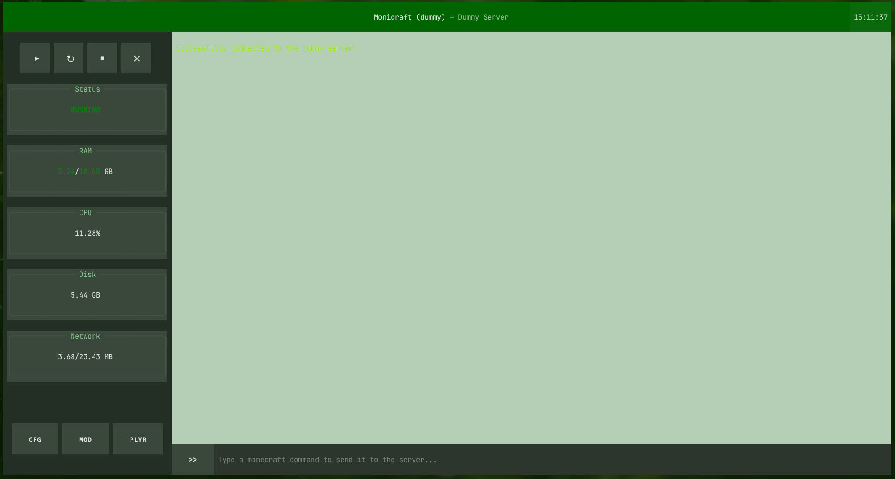

# Monicraft

---
Monicraft is a TUI-based application that makes it easier to monitor your rented or self-hosted Minecraft servers that run on the Pterodactyl panel (or some forked versions of it). It communicates through websockets and requests to the REST API to make it fast and responsive. It retreives more information by using the [mcstatus](https://github.com/py-mine/mcstatus) python library and inspects NBT data with the [nbtlib](https://github.com/vberlier/nbtlib) python library.

## Features
---
- [🖥️] **Real-Time Console Monitoring:** The server console is streamed directly into your interface and formatted with `RichLog`.
- [>_ ] **Command Execution:** Minecraft commands can be sent to the server, the server will execute them and the output will appear in the **console**.
- [⚡] **Power Actions:** Power buttons allow you to start, stop, restart or kill your server whenever it's needed.
- [📊] **Resource Monitoring:** The sidebar shows the state, CPU usage and RAM usage, disk usage and network inbound/outbound of the server in real-time through websockets.
- [💬] **Chat Mode:** Makes it possible to just type messages, instead of having to add *say* to your command every time you want to send a message to your server.
- [⚙️] **Settings Page:** An interactive settings page where you're able to change your environment variables, which are then safely stored in `.env`. You can also change intervals for fetching data and change the prefix for **Chat Mode**.
- [🛠️] **Mod Page:** An organized page where all the installed mods are shown, together with their size and the date and time they were last changed.
- [👥] **Player Manager:**
    - [📃] **Player List:** An overview of all the players on the server.
    - [📵] **Include Offline Player Toggle:** A button which toggles the visibility of offline players in the **Player List**. This data is cached and stored in memory, so it only has to fetch this once for offline players.
    - [⛔] **Kicking and Banning:** Ban or kick the selected player in the **Player List** with the option to add a reason. (*kicking: online; banning: online/offline*)
    - [📩] **Message Players:** Send private in-game messages to individual players without broadcasting to the entire server. (*online*)
    - [🎮] **Change Gamemodes:** Change players' gamemodes easily through a clean selection pop-up. (*online*)
    - [📈] **Statistics Viewer:** View all the stats of any player: General stats (play time, deaths, etc.), Entities (amount of entities killed) and Items (crafted, mined, used, broken, picked up, dropped). (*online/offline*)

# Installation Guide
---
## Installation through binary
Download the right binary for your operating system from the [v1.0.0 Release](https://github.com/Camiel13/Monicraft/releases/tag/v1.0.0) and run the following commands:

Windows:
```shell
# Start the program
.\monicraft-windows.exe

# Or start the program in dummy mode
.\monicraft-windows.exe --dummy
```

Linux:
```bash
# Make executable and start the program
chmod +x monicraft-linux
./monicraft-linux

# Or start the program in dummy mode
./monicraft-linux --dummy
```

## Installation from source
Clone the repository, install the dependencies in a virtual environment and run the following commands:

Windows:
```shell
git clone https://github.com/Camiel13/Monicraft.git
cd Monicraft

# Create and activate a virtual environment
python -m venv venv
.\venv\Scripts\activate

# Install dependencies
pip install -r requirements.txt

# Start the program
python main.py

# Or start the program in dummy mode
python main.py --dummy
```

Linux:
```bash
git clone https://github.com/Camiel13/Monicraft.git
cd Monicraft

# Create and activate a virtual environment
python3 -m venv venv
source venv/bin/activate

# Install dependencies
pip install -r requirements.txt

# Start the program
python3 main.py

# Or start the program in dummy mode
python3 main.py --dummy
```

# Configuration
---
You can configure your server credentials either directly in the **Settings (ᴄꜰɢ)** menu inside the app, or by creating a `.env` file in the root directory:

```env
API_KEY="ptlc_xxxxxxxxxxxxxxxxxxxxxxxx"
PANEL_ENDPOINT="panel.yourdomain.com"
SERVER_ID="698408ad"
```

# AI declaration
---
I used AI to get familiar with python libraries used in my project by asking it how it's used what the the common use cases are. I also used AI to debug weird behaviour caused by Textual CSS. All the code is written by me and nothing is copied over or written directly into my files by AI.